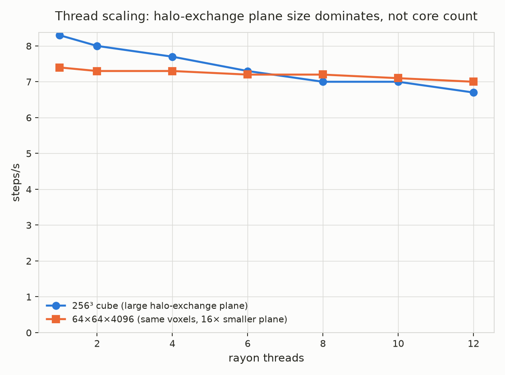

# Performance: is the SIMD real, and does the parallelism actually help?

This document covers two questions that "it runs and produces correct
output" (see `VALIDATION.md`) doesn't answer: is the AVX2 vectorization
`src/fdtd.rs` is written for actually being emitted, rather than silently
falling back to scalar code — and does `src/engine.rs`'s rayon-based domain
decomposition actually make the solver faster as more threads are thrown at
it. The second question turned up a real, counterintuitive result: on this
machine, more threads can make the solver *slower*, and the reason why is
specific and fixable, not a vague "parallelism has overhead" hand-wave.

## AVX2 codegen: confirmed, not assumed

`Cargo.toml`'s build instructions insist on `-C target-cpu=native -C
target-feature=+avx2`, and `src/fdtd.rs`'s docs claim every row of a Yee
update is "loaded, updated, and stored as a single SIMD instruction" — but a
claim like that is easy to get wrong silently: a missed `RUSTFLAGS`, a
codegen decision that falls back to scalar, or `std::simd` lowering
differently than expected would all still compile and run correctly (just
slower), with nothing in `cargo build`'s output to flag it.

Checked directly, by disassembling the release binary and finding the
actual hot-loop closures:

```sh
RUSTFLAGS="-C target-cpu=native -C target-feature=+avx2" cargo +nightly build --release
objdump -d --no-show-raw-insn target/release/wavefront > /tmp/wf_disasm.txt

# Which functions have the most 256-bit (ymm-register) AVX instructions?
awk '
/^[0-9a-f]+ </ { if (name != "") print count, name; name=$0; count=0; next }
/ymm/ { count++ }
END { if (name != "") print count, name }
' /tmp/wf_disasm.txt | sort -rn | head -5
```

The top two results (237 and 223 `ymm`-register instructions each) are
`rayon`'s `bridge_producer_consumer::helper` closures for `engine::run`'s two
`par_chunks_mut(...).for_each(...)` calls — the H-update and E-update phases
— with `update_slab_h`/`update_slab_e` (and, through them,
`fdtd::update_h_field`/`update_e_field`) fully inlined into them by LTO.
Nothing else in this crate has any reason to touch a 256-bit vector
register. Pulling just the H-update closure's instruction mix out confirms
it's genuine float32 SIMD arithmetic matching the Yee curl update's actual
operations (`Da*Hx - Db*curl`), not, say, a vectorized `memcpy`:

| Instruction | Count | Meaning |
|---|---:|---|
| `vmovups`      | 78 | unaligned load/store of a `f32x8` row |
| `vmulps`       | 42 | multiply (coefficient × field/curl term) |
| `vsubps`       | 36 | subtract (the curl differences) |
| `vaddps`       | 12 | add |
| `vbroadcastss` | 12 | broadcast a scalar into a lane (the `MaterialCoeffs` gather) |

This is direct evidence, not an assumption: the exact functions that run
every timestep, on every worker thread, are genuinely vectorized.

## Thread scaling: a real, mechanism-level finding

### Method

`benchmarks/thread_scaling.sh` runs the same total voxel count (256³ =
16,777,216 voxels) at two very different aspect ratios, across
`RAYON_NUM_THREADS` from 1 up to `nproc`, timing only the solver loop
(`engine::run`'s own `steps/s` printout, which excludes material
voxelization and coefficient-grid setup):

- **`cube`**: 256×256×256. Z-slab decomposition (`src/engine.rs`) splits
  this into up to 11-12 slabs at high thread counts, each with a large
  256×256-voxel (32×32-block) XY cross-section.
- **`tall`**: 64×64×4096. Same 16,777,216 total voxels, same number of
  slabs at a given thread count, but each slab's cross-section is
  64×64 voxels (8×8 blocks) — **16× smaller**.

The only structural difference between the two runs is the size of the
plane of field data exchanged at each internal slab boundary
(`crossbeam_channel`-based halo exchange, once per H-update and once per
E-update, per boundary, per step — see `src/engine.rs`'s module docs).

### Result



| Threads | `cube` steps/s | `tall` steps/s |
|---:|---:|---:|
| 1  | 8.3 | 7.4 |
| 2  | 8.0 | 7.3 |
| 4  | 7.7 | 7.3 |
| 6  | 7.3 | 7.2 |
| 8  | 7.0 | 7.2 |
| 10 | 7.0 | 7.1 |
| 12 | 6.7 | 7.0 |

- **`cube` gets *slower* with more threads**: 8.3 → 6.7 steps/s from 1 to 12
  threads, a **20% regression**, monotonic at every step along the way. In
  cell-updates/second terms (a standard FDTD throughput metric): 140M
  cells/s at 1 thread vs. 112M cells/s at 12 threads — using all 12 threads
  does *less* total work per second than using one.
- **`tall` is nearly flat**: 7.4 → 7.0 steps/s, a 4% regression — the same
  qualitative direction, but five times smaller.
- Both measurements repeat tightly (two full re-runs of the 1-thread and
  12-thread `cube` cases landed within 1-2% of each other), so this isn't
  noise.

### Why: halo-exchange bandwidth, not core count or fundamental memory bandwidth

`src/engine.rs`'s halo exchange sends a *cloned, newly heap-allocated* copy
of a full boundary XY-plane of `FieldBlock`s (`slab[..plane].to_vec()` /
`slab[slab.len()-plane..].to_vec()`) through a `crossbeam_channel`, once per
phase, per internal slab boundary, every single timestep. For the `cube`
shape at 12 threads (11 slabs, 10 internal boundaries), that's:

```
plane size    = 32 x 32 blocks x 12,288 bytes/block  = 12.58 MB
per step      = 10 boundaries x 2 phases x 12.58 MB   = 251.7 MB
```

251.7 MB of clone-and-channel-transfer traffic, *every step*, is a lot to
pay relative to the actual compute: 16,777,216 voxels split across 11 slabs
is only ~1.5M voxels of real Yee-update work per slab. For the `tall` shape,
the same math gives **17.3 MB/step** — a ~14.5× reduction, closely tracking
the 16× smaller plane (the difference is just 10 vs. 11 boundaries at
slightly different slab counts) — and the measured scaling penalty shrinks
by almost exactly the same factor (20% → 4%). That's not a coincidence; it's
the mechanism.

Reshaping away the halo-exchange penalty doesn't turn the flat line into a
*rising* one, though — `tall` is still roughly flat, not faster with more
threads. The AMD Ryzen 5 5600G here is a 6-core/12-thread (SMT) desktop APU
sharing memory bandwidth with its integrated GPU; the Yee update is a
classic low-arithmetic-intensity stencil (a handful of multiply-adds per
loaded/stored float, per the instruction mix above), which is exactly the
kind of workload that's memory-bandwidth-bound rather than compute-bound —
plausibly, a single thread already comes close to saturating this
machine's available memory bandwidth, leaving little headroom for more
threads to add. This part is a reasonable inference from a well-known
pattern in stencil-computation literature, not a directly measured
bandwidth number — `perf stat`'s hardware counters weren't available
without changing this machine's `perf_event_paranoid` setting (a system
security setting, left untouched rather than changed for a benchmark).

**Practical takeaway**: the current halo-exchange implementation makes
`src/engine.rs`'s Z-slab decomposition actively counterproductive for
domains with a large XY cross-section relative to their Z extent. Avoiding
the clone-and-reallocate pattern (e.g. reusing persistent per-boundary
scratch buffers instead of a fresh `Box<[FieldBlock]>` every phase) is a
concrete, well-understood follow-up — not attempted here, since it's a
change to the trickiest concurrency code in the crate and this session's
scope was measuring, not rewriting. Flagged in `HANDOFF.md`'s next steps.

## Snapshot writer throughput

### Method

`benchmarks/snapshot_throughput.sh` runs the same domain and step count
twice: once with `--snapshot-every` large enough that only the unavoidable
step-0 snapshot is written (see `src/engine.rs` — `step % snapshot_every ==
0` always fires at `step = 0` regardless of the configured interval), and
once with `--snapshot-every 1` (a write every step). The difference in
elapsed time, divided by the difference in bytes written, isolates the
writer's actual sustained throughput from solver compute time — the
double-buffered design overlaps writes with the *next* snapshot's compute,
so this is genuine marginal I/O cost, not a naive total-bytes-over-total-time
average that would also count time the writer spent idle waiting on compute.

### Result

At 256³ voxels (384 MiB/snapshot), 20 steps:

| Run | Elapsed | Snapshots written |
|---|---:|---:|
| Compute-only (1 snapshot) | 6.19s | 384 MiB |
| Every-step (20 snapshots) | 69.9s | 7.5 GiB |

```
extra bytes:     7,650,410,496
extra time:      63.7 s
throughput:      120 MB/s
```

120 MB/s is squarely in spinning-HDD sequential-write territory (not NVMe)
— consistent with `VALIDATION.md`'s out-of-core section, which already
established this machine's only Linux-accessible storage with free capacity
is an ext4-formatted HDD, not the NVMe device (fully consumed by a Windows
dual-boot install). This number characterizes *this machine's disk*, not
the writer's ceiling; on real NVMe the `O_DIRECT`/`io_uring` path itself
should sustain far more, but that's unverified here for the same reason the
out-of-core validation flagged it as an open item.

## Reproducing this

```sh
RUSTFLAGS="-C target-cpu=native -C target-feature=+avx2" \
    cargo +nightly build --release

benchmarks/thread_scaling.sh /path/on/a/real/disk
python3 benchmarks/plot_thread_scaling.py   # regenerates benchmarks/thread_scaling.png

benchmarks/snapshot_throughput.sh /path/on/a/real/disk
```

Both scripts default their thread sweep / domain size to sensible values but
accept overrides — see each script's header comment. Point them at a real
block device, not `tmpfs`, for the snapshot writer measurement to mean
anything.

These are not CI-gated (unlike `convergence_study.rs`/
`pml_reflection_study.rs`): throughput numbers are machine- and
load-dependent in a way phase velocity and reflection coefficients aren't,
so asserting a specific steps/s or MB/s in CI would just be flaky, not
rigorous.
