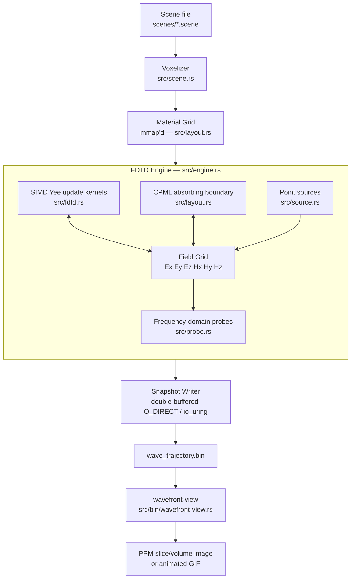
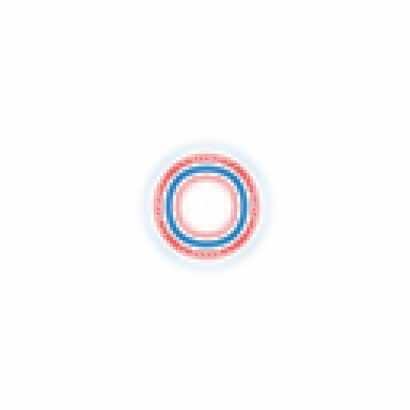
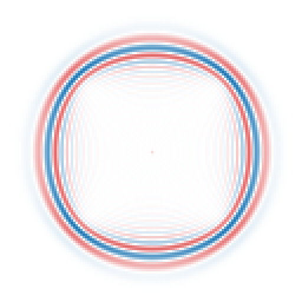
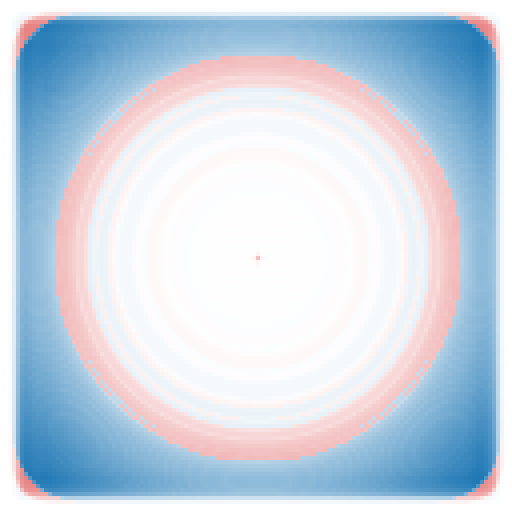

# wavefront

## Overview

Wavefront is a high-performance electromagnetic simulator that solves
Maxwell's equations on dense voxelized domains much larger than system
memory, written in pure Rust. It began as an HPC-systems exercise —
out-of-core data structures, SIMD kernels, race-free concurrent scheduling,
asynchronous I/O — and grew a second goal along the way: being legible and
credible on its own technical merits, not just working code. That's why the
numerical claims in this README are backed by a closed-form correctness
proof (see [Validation](#validation)) rather than left as an assertion.

Rust's ownership model is what makes the combination practical: thread-safe
parallel decomposition without a garbage collector, while still allowing
SIMD intrinsics, direct memory mapping, and asynchronous `io_uring` I/O.
The `unsafe` code that does appear — raw-pointer cross-slab access, `mmap`,
reinterpreting field blocks as raw bytes for the snapshot format — is
deliberately localized, each instance justified by its own inline `SAFETY`
comment.

## Features

- Out-of-core material grids up to ~200 GB, `mmap`-backed — exercised at
  real scale (512³ voxels) on disk, not just claimed
- AVX2-vectorized Yee-lattice update kernels, confirmed by disassembling
  the release binary
- Z-slab domain decomposition across a `rayon` thread pool, with race-free
  direct cross-slab reads (no per-boundary allocation or copy)
- Graded CPML absorbing boundary, so the domain behaves like open space
  instead of a sealed reflective box
- Double-buffered `O_DIRECT` + `io_uring` snapshot streaming — storage
  latency never stalls the timestep loop
- Configurable point sources (Gaussian, sinusoid, Ricker wavelet) and
  frequency-domain DFT probes, both repeatable per run
- Plain-text scene format (spheres/boxes tagged with material constants)
  for describing geometry, instead of only a hardcoded demo sphere
- `wavefront-view`: a second binary that renders a snapshot as a 2D slice
  or a whole-domain volume projection, or a snapshot range as an animated
  GIF

## Architecture



| Component | File |
|---|---|
| Material grid (mmap'd, disk-resident) | `src/layout.rs` |
| Field grid (SIMD-aligned AoSoA blocks) | `src/layout.rs` |
| Yee update kernels (AVX2, `std::simd`) | `src/fdtd.rs` |
| Domain decomposition & scheduling | `src/engine.rs` |
| CPML absorbing boundary | `src/layout.rs` |
| Snapshot I/O (`O_DIRECT` / `io_uring`) | `src/engine.rs` |
| Sources / frequency-domain probes | `src/source.rs` / `src/probe.rs` |
| Scene geometry voxelizer | `src/scene.rs` |
| Visualization | `src/bin/wavefront-view.rs` |

Two binaries share this core via a library crate (`src/lib.rs`):
`wavefront` (the simulator) and `wavefront-view` (post-processing).

## Validation

- **Second-order convergence**: measured phase-velocity error scales as
  `dx^2.16` against the Yee scheme's own closed-form prediction of `2.03`
  — both ≈2.0, the theoretical order for this scheme.
- **CPML absorption converges to its analytic target**: measured
  reflection coefficient drops monotonically over a 400× range of layer
  thickness, closing to `6.4e-6` against a configured target of `1e-6` at
  the thickest layer tested.
- **Bit-for-bit deterministic parallel execution**: the same domain run on
  1 thread vs. many rayon workers produces byte-identical field state.
- **Checked against the speed of light**: a point source's wavefront
  arrival time in vacuum matches `distance / c` directly — an independent
  check from the dispersion analysis above.


Both studies are hard-gated in CI on every push, not just run once and
screenshotted. See **[VALIDATION.md](VALIDATION.md)** for full methodology
— including two dead-end approaches and why they failed — or reproduce
directly:

```sh
cargo +nightly run --release --example convergence_study
cargo +nightly run --release --example pml_reflection_study
```

## Performance

- AVX2 vectorization confirmed by disassembling the release binary, not
  assumed from the `RUSTFLAGS`
- **+34%** parallel speedup (peak, 4-6 threads) after redesigning the halo
  exchange to read cross-slab neighbor data directly instead of cloning it
  through a channel every step — verified bit-for-bit identical to a
  single-slab reference
- ~120 MB/s sustained snapshot-writer throughput on this machine's HDD
  (disk-bound, not solver-bound — real NVMe should sustain more)


See **[PERFORMANCE.md](PERFORMANCE.md)** for the full halo-exchange
finding-and-fix story, or reproduce:

```sh
benchmarks/thread_scaling.sh /path/on/a/real/disk
benchmarks/snapshot_throughput.sh /path/on/a/real/disk
```

## Getting Started

Requires **Rust nightly** (the Yee kernels use `std::simd`, not yet
stabilized) and **Linux** kernel ≥5.6 (`io_uring`), with an
`O_DIRECT`-capable output filesystem (ext4/xfs/btrfs; not tmpfs).

```sh
rustup toolchain install nightly && rustup override set nightly

RUSTFLAGS="-C target-cpu=native -C target-feature=+avx2" \
    cargo +nightly build --release

./target/release/wavefront          # runs the demo sphere scenario
./target/release/wavefront --help   # full flag reference

cargo +nightly test --release       # 34 tests, well under a second
```

> **Licensing note:** the `rio` crate (used for `io_uring`) is GPL-3.0 by
> default; an MIT/Apache-2.0 dual license is available by sponsoring the
> author. Confirm this is acceptable before distributing a binary built
> against it.

## Documentation

- **[VALIDATION.md](VALIDATION.md)** — numerical correctness studies
  (convergence order, CPML reflection coefficient), methodology and
  results in full
- **[PERFORMANCE.md](PERFORMANCE.md)** — AVX2 codegen verification,
  thread-scaling investigation, snapshot-writer throughput
- `./target/release/wavefront --help` and `wavefront-view --help` — the
  full CLI flag reference for each binary (sources, probes, scene files,
  render modes, etc.)
- On-disk snapshot format: not restated here — see `src/engine.rs`'s
  `serialize_snapshot` and `src/layout.rs`'s `FieldBlock` doc comments for
  the exact byte layout, if writing your own reader

## Examples



```sh
./target/release/wavefront --nx 128 --ny 128 --nz 128 \
    --steps 500 --snapshot-every 25 \
    --scene scenes/two_spheres.scene \
    --source-waveform sinusoid --source-freq 3e10 \
    --materials /mnt/nvme/materials.grid \
    --output /mnt/nvme/wave_trajectory.bin
```

Then render the output with `wavefront-view`:

```sh
./target/release/wavefront-view \
    --input /mnt/nvme/wave_trajectory.bin --nx 128 --ny 128 --nz 128 \
    --snapshots 2:7 --component ez --fps 5 --output wave.gif
```

| Slice (`--mode slice`) | Volume (`--mode volume`) |
|---|---|
|  |  |

Scene files (`scenes/two_spheres.scene` is a worked example) describe
spheres/boxes in voxel-index units, one distinct `(eps_r, mu_r, sigma)`
triple per material:

```text
sphere <eps_r> <mu_r> <sigma> <cx> <cy> <cz> <radius>
box    <eps_r> <mu_r> <sigma> <x0> <y0> <z0> <x1> <y1> <z1>
```

## License

Licensed under either of [Apache License, Version 2.0](LICENSE-APACHE) or
[MIT license](LICENSE-MIT) at your option.
