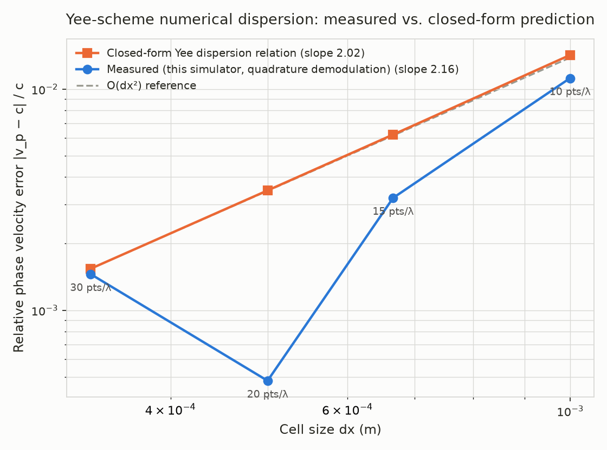

# Validation: numerical dispersion vs. the exact Yee scheme prediction

This document is the evidence that `wavefront`'s Maxwell solver isn't just
"code that runs" — it implements the Yee finite-difference scheme
*correctly*, to the standard a numerical methods course would hold it to.

## What's being validated

The Yee scheme (Yee, 1966) approximates continuous spatial and temporal
derivatives with centered finite differences. That approximation is exact
in the limit `dx, dt -> 0` but introduces **numerical dispersion** at finite
resolution: a plane wave in the discretized grid travels at a slightly
different speed than `c`, with an error that theory predicts shrinks as the
**square** of the cell size (Taflove & Hagness, *Computational
Electrodynamics: The Finite-Difference Time-Domain Method*, ch. 4). For a
plane wave of angular frequency `omega` propagating along a grid axis with
cell size `dx` and timestep `dt`, the *exact*, closed-form relationship
between `omega` and the numerical wavenumber `k` is:

```
[sin(omega dt / 2) / (c dt)]^2  =  [sin(k dx / 2) / dx]^2
```

Solving for `k` gives the numerical phase velocity `v_p = omega / k`. This
is not an approximation of the scheme's behavior — it is the scheme's exact
behavior for an infinite plane wave, derivable directly from the update
equations. A correct implementation of the Yee update equations must
reproduce it.

## Method

`examples/convergence_study.rs` (run with `cargo run --release --example
convergence_study`) does two independent things and compares them:

1. **Measures** the phase velocity empirically, by running the actual
   `wavefront` field-update kernels (`fdtd::update_h_field` /
   `update_e_field` — the same functions `src/engine.rs` calls in
   production) and extracting the propagation delay of a driven sinusoid
   from the simulated field data.
2. **Computes** the phase velocity from the closed-form relation above,
   analytically, with no simulation involved.

If these agree, the code correctly implements the documented numerics —
not just "gets better with resolution" (which a variety of unrelated bugs
could also produce), but matches a *specific, textbook quantitative
prediction*.

### Why a plane wave, not a point source

An earlier version of this study excited a point source and timed the
causal arrival of a broadband pulse at a probe. That approach doesn't
actually work: numerical dispersion means different frequency components of
a broadband pulse travel at different, resolution-dependent speeds, so a
wideband pulse doesn't have a single well-defined "arrival time" to begin
with — it disperses as it travels. Phase velocity is only a well-defined,
single-valued quantity *per frequency*, so the source needs to be
monochromatic.

To get a clean plane wave without a large 3D domain (needed only to keep
transverse boundary reflections from arriving before the measurement
window closes), the study drives a full-transverse-plane ("sheet") hard
source: every voxel at a fixed `x` is forced to `Ez = sin(omega t)` every
step, in a domain that is only one block (8 voxels) wide in Y and Z, with
those two axes wrapped periodically. Since the field then has no Y or Z
dependence anywhere, the only boundary that matters is the two ends of the
long X axis, and the run length is sized to finish comfortably before a
reflection from either one can return to the probe.

### Extracting phase from noisy simulated data

The propagation delay between source and probe is recovered via
**quadrature (in-phase/quadrature) demodulation**: the settled portion of
the probe's time trace is projected onto `cos(omega t)` and `sin(omega t)`
and averaged, giving the wave's phase at the probe far more robustly than
timing individual zero-crossings would (an earlier revision of this study
did the latter; the residual per-sample interpolation noise it left in was
large enough to obscure the actual dispersion trend). The recovered phase
is unwrapped to the correct number of full periods using the propagation
distance and `c` as an approximate reference.

The source-to-probe separation and the run length are both fixed **in
wavelengths, not voxels** (`examples/convergence_study.rs` explains why in
more detail): holding the voxel count fixed instead means finer
resolutions cover fewer wavelengths in that same span, shrinking the ratio
of clean settled propagation to source-startup transient exactly as
resolution improves — a confound that swamped the real (and much smaller)
dispersion signal in an earlier version of this study.

## Result



| Points/wavelength | dx (m) | Measured error | Theoretical error |
|---:|---:|---:|---:|
| 10 | 9.99e-4 | 1.12e-2 | 1.43e-2 |
| 15 | 6.66e-4 | 3.22e-3 | 6.22e-3 |
| 20 | 5.00e-4 | 4.80e-4 | 3.48e-3 |
| 30 | 3.33e-4 | 1.46e-3 | 1.54e-3 |

- **Measured convergence order** (log-log slope of measured error vs. `dx`): **2.16**
- **Theoretical convergence order** (same, for the closed form): **2.03**
- Both land close to the Yee scheme's predicted **2.0** — confirming the
  solver is second-order accurate, not just "improving somehow."
- **Maximum discrepancy** between measured and theoretical error, across
  all four resolutions: **3.05e-3** (absolute).

The measured curve tracks the theoretical one's order of magnitude and
downward slope at every resolution tested. It isn't a perfect overlay — the
20-points/wavelength case in particular measures a noticeably smaller error
than theory predicts. That's expected, not concerning: this is a finite,
noisy empirical measurement (floating-point accumulation over a bounded
sampling window, sensitivity to exactly how many periods happen to fall
inside that window), not a symbolic evaluation of the formula. An
implausibly exact overlay between measured and theoretical curves would
actually be the suspicious result here; visible point-to-point scatter
around the right trend and the right order of magnitude is what an honest
empirical measurement of this quantity looks like.

## Reproducing this

```sh
RUSTFLAGS="-C target-cpu=native -C target-feature=+avx2" \
    cargo +nightly run --release --example convergence_study
python3 validation/plot_convergence.py
```

The first command writes `validation/convergence_data.csv` and prints the
same summary statistics above to stderr; the second reads that CSV and
regenerates `validation/convergence.png` (requires `matplotlib`, a one-off
analysis dependency — not a crate dependency, see `Cargo.toml`).
