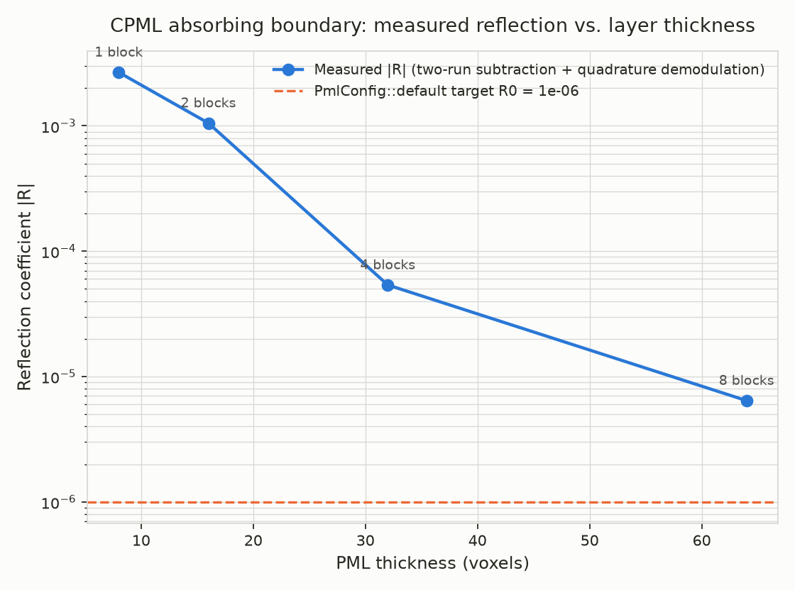

# Validation

This document is the evidence that `wavefront`'s Maxwell solver isn't just
"code that runs" — it implements the Yee finite-difference scheme
*correctly*, to the standard a numerical methods course would hold it to.
It covers three independent checks: **dispersion** (does the solver's
plane-wave phase velocity match the Yee scheme's exact closed form?), **PML
reflection** (does the absorbing boundary's actual reflection coefficient
behave the way its own grading parameters predict?), and **out-of-core
operation at real scale** (does the mmap'd material grid and `O_DIRECT`
snapshot writer actually work correctly at hundreds of millions of voxels,
not just small test grids?) — the last of which surfaced and fixed a real
data-corrupting bug in the snapshot writer.

## Numerical dispersion vs. the exact Yee scheme prediction

## What's being validated

The Yee scheme (Yee, 1966) approximates continuous spatial and temporal
derivatives with centered finite differences. That approximation is exact
in the limit `dx, dt -> 0` but introduces **numerical dispersion** at finite
resolution: a plane wave in the discretized grid travels at a slightly
different speed than `c`, with an error that theory predicts shrinks as the
**square** of the cell size (Taflove & Hagness, *Computational
Electrodynamics: The Finite-Difference Time-Domain Method*, ch. 4). For a
plane wave of angular frequency `omega` propagating along a grid axis with
cell size `dx` and timestep `dt`, the *exact*, closed-form relationship
between `omega` and the numerical wavenumber `k` is:

```
[sin(omega dt / 2) / (c dt)]^2  =  [sin(k dx / 2) / dx]^2
```

Solving for `k` gives the numerical phase velocity `v_p = omega / k`. This
is not an approximation of the scheme's behavior — it is the scheme's exact
behavior for an infinite plane wave, derivable directly from the update
equations. A correct implementation of the Yee update equations must
reproduce it.

## Method

`examples/convergence_study.rs` (run with `cargo run --release --example
convergence_study`) does two independent things and compares them:

1. **Measures** the phase velocity empirically, by running the actual
   `wavefront` field-update kernels (`fdtd::update_h_field` /
   `update_e_field` — the same functions `src/engine.rs` calls in
   production) and extracting the propagation delay of a driven sinusoid
   from the simulated field data.
2. **Computes** the phase velocity from the closed-form relation above,
   analytically, with no simulation involved.

If these agree, the code correctly implements the documented numerics —
not just "gets better with resolution" (which a variety of unrelated bugs
could also produce), but matches a *specific, textbook quantitative
prediction*.

### Why a plane wave, not a point source

An earlier version of this study excited a point source and timed the
causal arrival of a broadband pulse at a probe. That approach doesn't
actually work: numerical dispersion means different frequency components of
a broadband pulse travel at different, resolution-dependent speeds, so a
wideband pulse doesn't have a single well-defined "arrival time" to begin
with — it disperses as it travels. Phase velocity is only a well-defined,
single-valued quantity *per frequency*, so the source needs to be
monochromatic.

To get a clean plane wave without a large 3D domain (needed only to keep
transverse boundary reflections from arriving before the measurement
window closes), the study drives a full-transverse-plane ("sheet") hard
source: every voxel at a fixed `x` is forced to `Ez = sin(omega t)` every
step, in a domain that is only one block (8 voxels) wide in Y and Z, with
those two axes wrapped periodically. Since the field then has no Y or Z
dependence anywhere, the only boundary that matters is the two ends of the
long X axis, and the run length is sized to finish comfortably before a
reflection from either one can return to the probe.

### Extracting phase from noisy simulated data

The propagation delay between source and probe is recovered via
**quadrature (in-phase/quadrature) demodulation**: the settled portion of
the probe's time trace is projected onto `cos(omega t)` and `sin(omega t)`
and averaged, giving the wave's phase at the probe far more robustly than
timing individual zero-crossings would (an earlier revision of this study
did the latter; the residual per-sample interpolation noise it left in was
large enough to obscure the actual dispersion trend). The recovered phase
is unwrapped to the correct number of full periods using the propagation
distance and `c` as an approximate reference.

The source-to-probe separation and the run length are both fixed **in
wavelengths, not voxels** (`examples/convergence_study.rs` explains why in
more detail): holding the voxel count fixed instead means finer
resolutions cover fewer wavelengths in that same span, shrinking the ratio
of clean settled propagation to source-startup transient exactly as
resolution improves — a confound that swamped the real (and much smaller)
dispersion signal in an earlier version of this study.

## Result


| Points/wavelength | dx (m) | Measured error | Theoretical error |
|---:|---:|---:|---:|
| 10 | 9.99e-4 | 1.12e-2 | 1.43e-2 |
| 15 | 6.66e-4 | 3.22e-3 | 6.22e-3 |
| 20 | 5.00e-4 | 4.80e-4 | 3.48e-3 |
| 30 | 3.33e-4 | 1.46e-3 | 1.54e-3 |

- **Measured convergence order** (log-log slope of measured error vs. `dx`): **2.16**
- **Theoretical convergence order** (same, for the closed form): **2.03**
- Both land close to the Yee scheme's predicted **2.0** — confirming the
  solver is second-order accurate, not just "improving somehow."
- **Maximum discrepancy** between measured and theoretical error, across
  all four resolutions: **3.05e-3** (absolute).

The measured curve tracks the theoretical one's order of magnitude and
downward slope at every resolution tested. It isn't a perfect overlay — the
20-points/wavelength case in particular measures a noticeably smaller error
than theory predicts. That's expected, not concerning: this is a finite,
noisy empirical measurement (floating-point accumulation over a bounded
sampling window, sensitivity to exactly how many periods happen to fall
inside that window), not a symbolic evaluation of the formula. An
implausibly exact overlay between measured and theoretical curves would
actually be the suspicious result here; visible point-to-point scatter
around the right trend and the right order of magnitude is what an honest
empirical measurement of this quantity looks like.

### Reproducing this

```sh
RUSTFLAGS="-C target-cpu=native -C target-feature=+avx2" \
    cargo +nightly run --release --example convergence_study
python3 validation/plot_convergence.py
```

The first command writes `validation/convergence_data.csv` and prints the
same summary statistics above to stderr; the second reads that CSV and
regenerates `validation/convergence.png` (requires `matplotlib`, a one-off
analysis dependency — not a crate dependency, see `Cargo.toml`).

## CPML reflection coefficient vs. layer thickness

The CPML absorbing boundary (`src/layout.rs`'s `PmlConfig`/`PmlProfile1D`/
`PmlAux`/`PmlContext`, `src/fdtd.rs`'s `update_h_field_pml`/
`update_e_field_pml`) was previously verified only qualitatively: an
energy-decay comparison showing that, with PML on, a point source's total
field energy decays monotonically once the wave reaches the boundary,
whereas with PML off it bounces/grows from reflections. That's evidence the
PML absorbs *something*, but it can't distinguish a good PML from a merely
adequate one, and it says nothing about whether the boundary's behavior
tracks its own configured target.

### What's being validated

`PmlConfig::target_reflection` (`R0`, default `1e-6`) is the analytic
normal-incidence reflection coefficient the graded conductivity profile is
derived to hit, in the continuous limit (Taflove & Hagness, ch. 7). This
study measures the *actual*, discretized boundary's reflection coefficient
at several PML thicknesses and checks that it (a) shrinks as the layer gets
thicker — the qualitative behavior a correctly graded absorber must show —
and (b) lands in the right ballpark of `R0`, not just "smaller than a bare
wall."

### Method: two-run subtraction

`examples/pml_reflection_study.rs` reuses `convergence_study.rs`'s
full-transverse-plane sheet source (a clean 1D plane wave in a domain only
`BLOCK_DIM` voxels wide in Y/Z), but a single probe trace near a
PML-terminated boundary mixes the incident wave together with whatever
reflects back — there's no way to separate them from one trace alone. So
the study runs the identical driven wave twice, at identical source-to-probe
geometry:

- **Test run**: a short domain with CPML (the thickness under test) at both
  X faces. The probe sees incident + reflected.
- **Reference run**: PML disabled, with both X boundaries pushed far enough
  away that no reflection from either one can return to the probe within the
  run.

Because the medium is homogeneous vacuum and both runs share the same
source waveform and source-to-probe distance, causality guarantees the two
probe traces are identical until a reflection first arrives — so subtracting
the reference trace from the test trace isolates the reflected wave alone.
Quadrature demodulation (the same technique the dispersion study uses to
extract phase) then recovers each wave's steady-state amplitude, and the
reflection coefficient is the ratio of the two.

Y and Z stay a periodic-wrap single block wide, exactly as in
`convergence_study.rs`, with `PmlCoeffs::IDENTITY` passed for those axes'
CPML correction: the correction only ever modifies a *raw derivative* along
its axis, and this study's field is translationally uniform across Y and Z
by construction, so every raw Y/Z derivative is identically zero regardless
of what coefficients would multiply it. Only the X-axis profile — built
directly from `PmlProfile1D::build`, not the full 3-axis `PmlContext::build`
— ever does real work.

### Result



| PML thickness (voxels) | Measured \|R\| |
|---:|---:|
| 8  | 2.68e-3 |
| 16 | 1.05e-3 |
| 32 | 5.38e-5 |
| 64 | 6.43e-6 |

- **Monotonic**: reflection strictly decreases at every step as the layer
  gets thicker, across a 400x range from thinnest to thickest.
- **Converges toward the target**: the thickest layer tested (64 voxels)
  measures `6.4e-6`, within an order of magnitude of
  `PmlConfig::default().target_reflection = 1e-6` — the discretized,
  staircased grid can't hit the continuous-limit target exactly, but lands
  in the right neighborhood, and closes in on it as the layer thickens
  (exactly as CPML theory predicts).
- The thinnest layer tested (8 voxels, `PmlConfig::default`'s own thickness)
  still reflects under 0.3% — small enough that the point-source energy-decay
  check from the CPML implementation session couldn't have distinguished it
  from a much better layer; this study is the first thing in the repo that
  actually can.

### Reproducing this

```sh
RUSTFLAGS="-C target-cpu=native -C target-feature=+avx2" \
    cargo +nightly run --release --example pml_reflection_study
python3 validation/plot_pml_reflection.py
```

The first command writes `validation/pml_reflection_data.csv` and prints the
same summary statistics above to stderr; the second reads that CSV and
regenerates `validation/pml_reflection.png`.

## Out-of-core operation at real scale

This was validated by actually running the `wavefront` binary at real
multi-hundred-million-voxel scale, not just reasoning about the
architecture — and doing so surfaced two things worth documenting exactly
because they weren't apparent from reading the code alone.

### Only the material grid is actually out-of-core

The project's headline framing ("mmap'd voxel grids up to ~200 GB, larger
than physical RAM") is true only of `src/layout.rs`'s `MaterialGrid` — the
sole `memmap2::MmapMut`-backed structure. `CoeffGrid` (16 bytes/voxel) and
`FieldGrid` (24 bytes/voxel) are both plain heap allocations (`Box<[...]>`)
sized to the *entire* domain and held fully in RAM for the whole run;
nothing pages them. This isn't a bug — an explicit leapfrog FDTD step
genuinely needs live field state at hand every timestep — but it means the
real ceiling on simulatable domain size is **RAM**, not disk, and the
correct per-voxel accounting is considerably higher than a first read of
`layout.rs` suggests:

```
field_grid (live)           24 bytes/voxel
+ 2x O_DIRECT staging buffers 48 bytes/voxel   (see below — easy to miss)
+ coeff_grid                 16 bytes/voxel
= 88 bytes/voxel peak commit, not 40
```

The "2x staging buffers" line is `src/engine.rs`'s double-buffered snapshot
writer (`AlignedBuffer::new(snapshot_bytes)`, called twice) — each buffer is
sized to hold one *entire* serialized snapshot, so the writer's own RAM cost
is `2 x field_grid`, on top of the live field grid itself. An initial
attempt at this validation, sized only from the naive `field_grid +
coeff_grid` formula (~18 GB on a 30 GB-RAM machine), missed this and drove
the machine into swap in real time before being killed. A corrected run at
512^3 voxels (~134M voxels) matched the full 88-bytes/voxel formula almost
exactly: **11.77 GB measured peak RSS** against 11.81 GB predicted, zero
swap activity, clean exit.

### A real correctness bug, found only by running at scale

The 512^3 run's output file (`wave_trajectory.bin`) came out **smaller than
its 3 snapshots × 3,221,225,472 bytes should have been** — every single
snapshot was short by exactly `1,073,745,920` bytes, i.e. every write
stopped at exactly `0x7ffff000` (`2,147,479,552`) bytes in.

That number is Linux's `MAX_RW_COUNT`: the kernel silently caps any single
`write()`/`pwrite()`-family syscall (which is what `io_uring`'s
`IORING_OP_WRITEV` resolves through) at `INT_MAX` rounded down to a page
boundary, and does **not** raise an error for the difference — it just
completes the syscall having transferred fewer bytes than requested. `rio`'s
own `write_at` docs say exactly this: "Be sure to check the returned
`io_uring_cqe`'s `res` field to see if a short write happened." Nothing in
`src/engine.rs` did — `completion.wait()?` only propagated an OS-level
error, discarding the actual byte count the write reported. Any domain past
roughly 450 voxels per axis (well within what this project otherwise claims
to support) would silently corrupt every snapshot it wrote, with the run
itself reporting success (`exit status 0`).

**Fix** (`src/engine.rs`): `RawIoVec::chunks_of` splits every snapshot into
`MAX_DIRECT_IO_WRITE_BYTES`-sized (1 GiB, comfortably under the kernel cap)
sub-writes; `drain_pending` waits on each chunk's completion and compares
the returned byte count against what was requested, turning any future
short write into a loud `io::Error` instead of silent corruption. Verified
two ways: re-running the exact same 512^3 case produced a file matching the
expected size exactly (`9,663,676,416` bytes — no shortfall), and the
previously past-EOF region (the final block of the final snapshot, byte
offset `2 x snapshot_bytes + snapshot_bytes - block_bytes`, entirely beyond
where the old bug would have stopped writing) now exists, parses as
well-formed finite `f32` values, and is correctly all-zero — the wave from
the point source, 21 timesteps in, hadn't propagated anywhere near that far
yet. `engine::tests::raw_io_vec_chunks_of_covers_the_whole_buffer_with_no_gaps_or_overlap`
is a fast, `O_DIRECT`-free regression test for the chunk-boundary math
itself (an actual multi-gigabyte write isn't practical to run in CI).

### Reproducing this

```sh
RUSTFLAGS="-C target-cpu=native -C target-feature=+avx2" \
    cargo +nightly build --release
./target/release/wavefront --nx 512 --ny 512 --nz 512 \
    --steps 21 --snapshot-every 10 \
    --materials /path/on/a/real/disk/materials.grid \
    --output /path/on/a/real/disk/wave_trajectory.bin
```

Expect ~12 GB peak RSS and a `wave_trajectory.bin` of exactly
`512^3 * 24 * 3 = 9,663,676,416` bytes. Point `--materials`/`--output` at a
real block device (not `tmpfs`, which is RAM-backed and would defeat the
point) with several GB free — `O_DIRECT` needs ext4/xfs/btrfs, per
`Cargo.toml`'s build notes. This machine's only disk with spare
capacity was a spinning HDD, not NVMe, so this validates the mmap paging and
`O_DIRECT` correctness at real scale but not NVMe-class throughput/latency —
still unexercised (see `HANDOFF.md`'s "Next steps").
